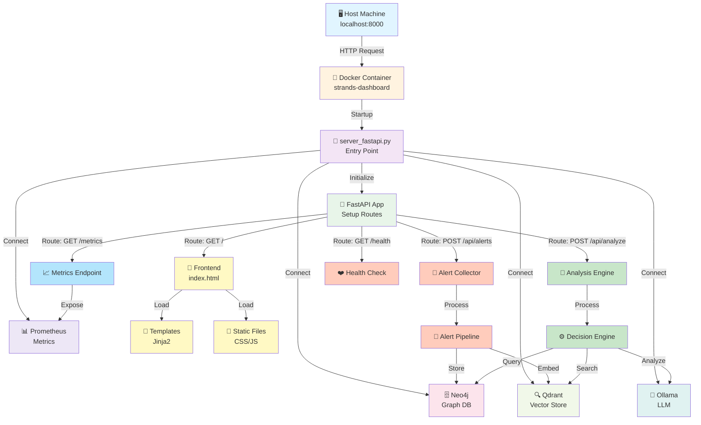
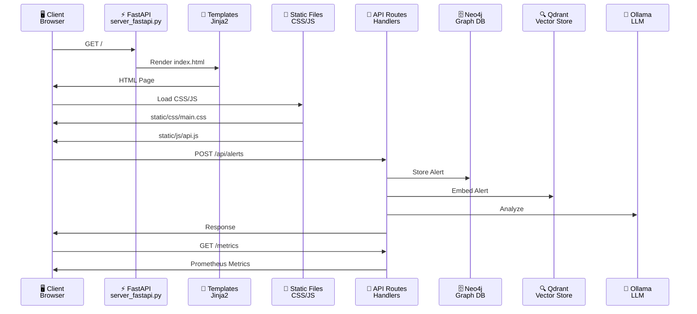
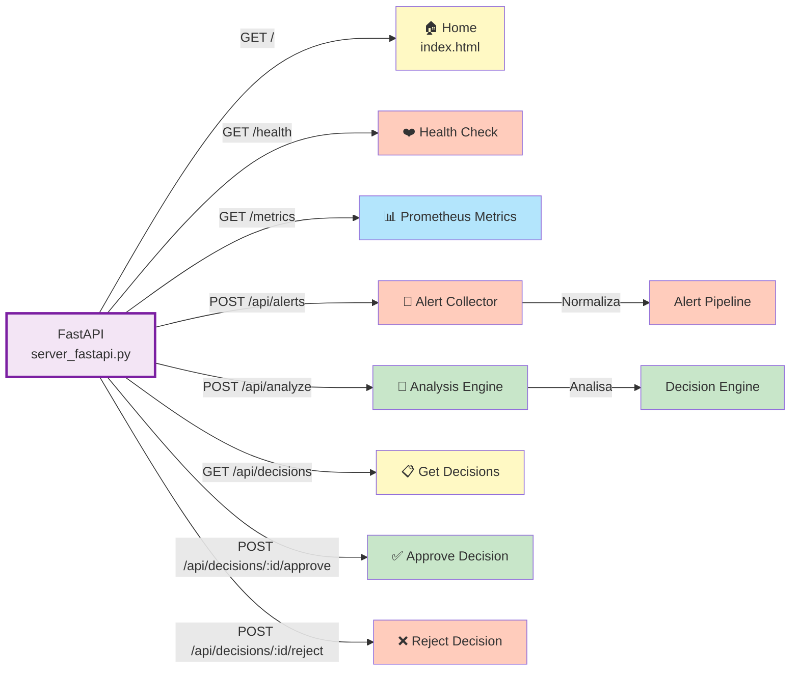
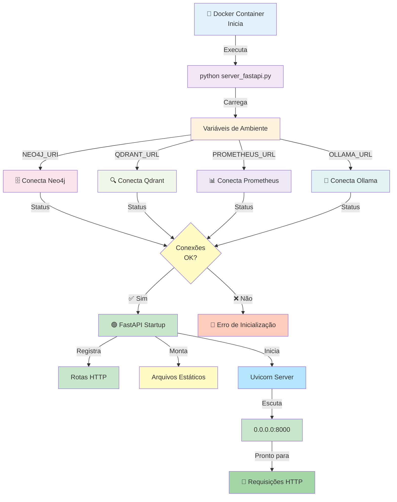
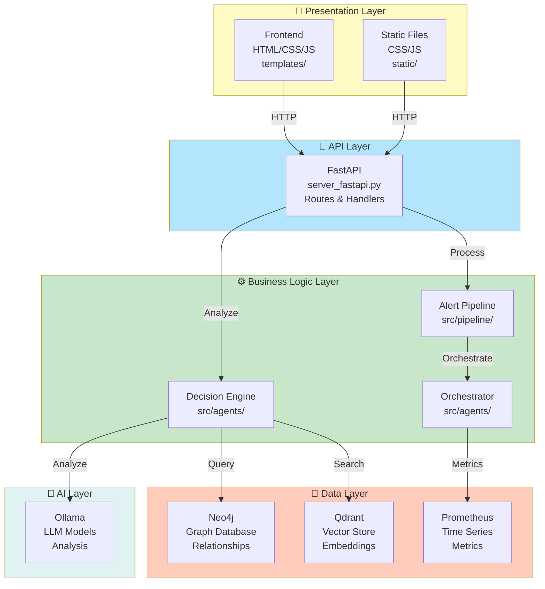
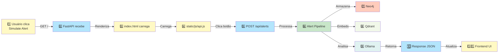
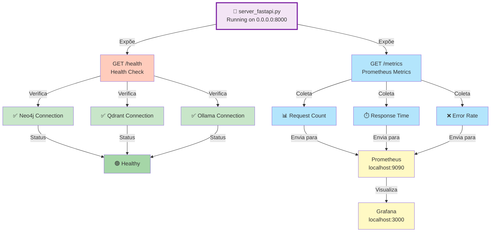

# 🚀 Strands - Entry Point Architecture

## 📍 Ponto de Entrada Principal

O ponto de entrada da aplicação Strands é o arquivo **`server_fastapi.py`**, que inicializa a aplicação FastAPI e orquestra todos os componentes.

## 🎯 Fluxo de Inicialização



## 📋 Detalhes do Entry Point

### 1. **server_fastapi.py** - Arquivo Principal

```python
# Localização: /home/ubuntu/strands/server_fastapi.py

from fastapi import FastAPI
from fastapi.staticfiles import StaticFiles
from fastapi.templating import Jinja2Templates

# Inicializar FastAPI
app = FastAPI(title="Strands Governance")

# Configurar templates Jinja2
templates = Jinja2Templates(directory="templates")

# Servir arquivos estáticos
app.mount("/static", StaticFiles(directory="static"), name="static")

# Inicializar conexões
@app.on_event("startup")
async def startup():
    # Conectar Neo4j
    # Conectar Qdrant
    # Conectar Prometheus
    # Conectar Ollama
    pass

# Rotas principais
@app.get("/")
async def home():
    return templates.TemplateResponse("index.html", {})

@app.post("/api/alerts")
async def receive_alert(alert: Alert):
    # Processar alerta
    pass

@app.post("/api/analyze")
async def analyze():
    # Executar análise
    pass

@app.get("/metrics")
async def metrics():
    # Expor métricas Prometheus
    pass

@app.get("/health")
async def health():
    # Health check
    pass
```

## 🔄 Fluxo de Requisição HTTP



## 🎯 Estrutura de Rotas



## 🚀 Processo de Startup



## 📊 Arquitetura em Camadas



## 🔌 Conectores Principais

### 1. **Frontend → FastAPI**
```
GET http://localhost:8000/
↓
server_fastapi.py @app.get("/")
↓
Renderiza templates/index.html
↓
Retorna HTML ao navegador
```

### 2. **Frontend → API**
```
POST http://localhost:8000/api/alerts
↓
server_fastapi.py @app.post("/api/alerts")
↓
Processa alerta
↓
Retorna JSON response
```

### 3. **FastAPI → Neo4j**
```
from neo4j import GraphDatabase
driver = GraphDatabase.driver(NEO4J_URI)
↓
Executa queries Cypher
↓
Armazena/recupera dados
```

### 4. **FastAPI → Qdrant**
```
from qdrant_client import QdrantClient
client = QdrantClient(QDRANT_URL)
↓
Busca vetorial
↓
Encontra similares
```

### 5. **FastAPI → Ollama**
```
import httpx
async with httpx.AsyncClient() as client:
    response = await client.post(f"{OLLAMA_URL}/api/generate")
↓
Análise com LLM
↓
Retorna insights
```

## 🎯 Fluxo Completo de Uma Requisição



## 📈 Monitoramento do Entry Point



## 🔑 Variáveis de Ambiente Necessárias

```bash
# Banco de dados
NEO4J_URI=bolt://neo4j:7687
NEO4J_USER=neo4j
NEO4J_PASSWORD=strads123

# Vector store
QDRANT_URL=http://qdrant:6333

# Observabilidade
PROMETHEUS_URL=http://prometheus:9090

# LLM
OLLAMA_URL=http://ollama:11434

# Servidor
LOG_LEVEL=INFO
```

## 🎓 Como Começar

### 1. **Iniciar Docker Compose**
```bash
docker-compose -f docker-compose-frontend.yml up -d
```

### 2. **Acessar Frontend**
```
http://localhost:8000
```

### 3. **Verificar Health**
```bash
curl http://localhost:8000/health
```

### 4. **Ver Métricas**
```bash
curl http://localhost:8000/metrics
```

### 5. **Testar API**
```bash
curl -X POST http://localhost:8000/api/alerts \
  -H "Content-Type: application/json" \
  -d '{"service": "payment-api", "severity": "critical"}'
```

---

**Arquivo**: ENTRY_POINT_ARCHITECTURE.md  
**Versão**: 1.0  
**Última atualização**: 2026-02-06
