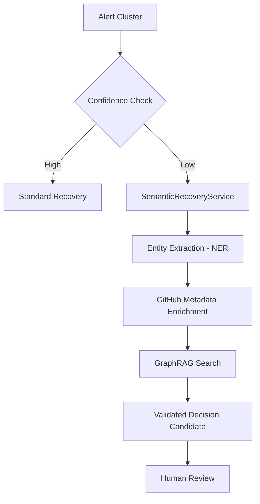

# Strands: Autonomous SRE Orchestration Framework

**Strands** is a high-performance, multi-agent framework designed for autonomous incident response and SRE (Site Reliability Engineering) automation. It leverages a **GraphRAG (Graph Retrieval-Augmented Generation)** architecture to move beyond simple vector similarity, providing deep semantic and structural context for incident resolution.

---

## 🏗️ Architecture & Design Principles

Strands is built on four core "Constitution Principles" that ensure reliability and traceability in production environments:

1.  **Human-in-the-Loop (HITL)**: Autonomous decisions are treated as candidates until confirmed by a human operator.
2.  **Determinism over Stochasticity**: Rule-based logic and Knowledge Graphs are prioritized over raw LLM calls to ensure consistent outcomes.
3.  **Controlled Learning**: Semantic memory (Knowledge Graph) is only updated after human validation, preventing "hallucination loops."
4.  **Full Traceability**: Every decision, evidence, and tool execution is recorded in a structured Audit Log.

### The Semantic Recovery Pipeline

The core of Strands is its **Semantic Recovery Service**, which integrates the [Semantica](https://github.com/Hawksight-AI/semantica) framework:



---

## 🚀 Key Features

-   **GraphRAG Integration**: Uses Semantica to navigate Knowledge Graphs, identifying relationships between services, events, and historical runbooks.
-   **Multi-Agent Swarm**: Parallel investigation specialists (Metrics, Code, Graph, Correlator) that consolidate findings into a single hypothesis.
-   **GitHub Models & MCP**: Native integration with GitHub Models and Model Context Protocol (MCP) for repository metadata and tool execution.
-   **LRU Semantic Cache**: High-performance caching of semantic results to minimize latency and LLM costs.
-   **Pydantic Validation**: Strict schema enforcement for all agent outputs and graph returns.

---

## 🛠️ Getting Started

### Prerequisites

-   Python 3.11+
-   `GITHUB_TOKEN` (with required scopes for Models and Repository access)

### Installation

```bash
# Clone and setup environment
git clone https://github.com/igorrhamon/strands
cd strands
python3 -m venv .venv
source .venv/bin/activate
pip install -r requirements.txt
```

### Configuration

Set your environment variables:
```bash
export GITHUB_TOKEN="your_token_here"
export SEMANTICA_MODEL="en_core_web_sm"
```

---

## 📂 Project Structure
- [**Agents Documentation**](docs/AGENTS.md): Detailed technical overview of all agents and their roles.

-   `src/agents/`: Core agent implementations (Orchestrator, DecisionEngine, MetricsAnalysis).
-   `src/services/`: Business logic services, including the `SemanticRecoveryService`.
-   `src/models/`: Pydantic data contracts for alerts, clusters, and decisions.
-   `src/rules/`: Deterministic rule sets for incident classification.
-   `src/providers/`: LLM and Model provider integrations (GitHub, Ollama, HTTP).

---

## 🧪 Testing & Quality Assurance

Strands follows a strict TDD approach. The suite includes unit tests for individual agents and integration tests for the full pipeline.

```bash
# Run all unit tests
pytest tests/unit

# Run semantic recovery specific tests
pytest tests/unit/test_semantic_recovery_service.py
```

---

## 🤝 Contributing

We follow a senior engineering workflow:
1.  **Specs First**: All major features must have a specification in `specs/`.
2.  **Type Safety**: Use Pydantic models for all data exchange.
3.  **Observability**: Include structured logs for all recovery attempts.

---

## 📄 License

This project is licensed under the MIT License - see the [LICENSE](LICENSE) file for details.
