# Strands — Distributed Diagnostic Swarm Intelligence

**Strands** is a production-ready framework for orchestrating autonomous agents to diagnose and resolve infrastructure incidents in Kubernetes environments. It combines multi-agent collaboration, semantic memory, causal reasoning, and human-in-the-loop governance to deliver intelligent, auditable incident response.

## Overview

Strands implements a **Swarm Intelligence** architecture where specialized agents work in parallel to analyze alerts, collect evidence, and recommend actions. The system prioritizes transparency and auditability through causal graphs, evidence scoring, and deterministic replay capabilities.

### Key Capabilities

**Multi-Agent Orchestration**: Five specialist agents (Metrics Analyst, Log Inspector, Embedding Agent, Graph Context, Correlator) execute in parallel, each contributing unique insights to incident analysis.

**Evidence-Based Decision Making**: All agent outputs are scored for confidence and traced through a causal graph, enabling post-incident audits and continuous learning.

**Kubernetes-Native Diagnostics**: Direct integration with `kubectl` for real-time log collection, pod inspection, and deployment context retrieval.

**Semantic Memory**: Vector embeddings of incidents and resolutions enable similarity-based recommendations for recurring problems.

**Governance & Control**: Automated decisions can be downgraded to manual review based on risk assessment, with full audit trails for compliance.

## Architecture

```mermaid
graph TB
    Alert["🚨 Alert Ingestion"] --> Normalizer["📋 Alert Normalizer"]
    
    Normalizer --> Orchestrator["⚙️ Swarm Orchestrator<br/>(Global Timeout: 30s)"]
    
    Orchestrator --> |Parallel Dispatch| MetricsAgent["📊 Metrics Analyst<br/>Prometheus Queries"]
    Orchestrator --> |Parallel Dispatch| LogAgent["🔍 Log Inspector<br/>kubectl logs"]
    Orchestrator --> |Parallel Dispatch| EmbeddingAgent["🧠 Embedding Agent<br/>Semantic Search"]
    Orchestrator --> |Parallel Dispatch| GraphAgent["📈 Graph Context<br/>Neo4j Relations"]
    Orchestrator --> |Parallel Dispatch| CorrelatorAgent["🔗 Correlator<br/>Pattern Matching"]
    
    MetricsAgent --> |SwarmResult| Consolidator["🎯 Decision Engine<br/>Hypothesis Synthesis"]
    LogAgent --> |SwarmResult| Consolidator
    EmbeddingAgent --> |SwarmResult| Consolidator
    GraphAgent --> |SwarmResult| Consolidator
    CorrelatorAgent --> |SwarmResult| Consolidator
    
    Consolidator --> |DecisionCandidate| Recommender["💡 Recommender Agent<br/>Action Suggestion"]
    
    Recommender --> RiskAssess["⚠️ Risk Assessment"]
    RiskAssess --> |High Risk| HumanReview["👤 Human Review"]
    RiskAssess --> |Low Risk| AutoExec["✅ Automated Execution"]
    
    HumanReview --> Outcome["📝 Incident Resolution"]
    AutoExec --> Outcome
    
    Outcome --> Memory["💾 Memory & Learning<br/>Vector DB + Neo4j"]
    
    style Alert fill:#ff6b6b
    style Orchestrator fill:#4ecdc4
    style Consolidator fill:#45b7d1
    style Memory fill:#96ceb4
    style HumanReview fill:#ffeaa7
```



## Agent Specifications

| Agent | Role | Status | Key Features |
|-------|------|--------|--------------|
| **Metrics Analyst** | Specialist | ✅ Implemented | Dynamic Prometheus queries, anomaly detection (latency > 2s, error rate > 5%), exponential backoff retry logic |
| **Log Inspector** | Specialist | ✅ Implemented | Kubernetes pod log streaming via `kubectl`, multi-line stack trace parsing (Java/Python), error categorization |
| **Embedding Agent** | Knowledge | ✅ Implemented | FastEmbed vector generation, Qdrant similarity search, incident history retrieval |
| **Graph Context** | Specialist | ✅ Implemented | Neo4j causal relationship queries, dependency mapping, blast radius analysis |
| **Correlator** | Specialist | ✅ Implemented | Pattern matching across agent outputs, conflict detection, hypothesis refinement |
| **Recommender** | Governance | ✅ Implemented | Heuristic-based action suggestions, risk-aware automation downgrade, historical pattern matching |
| **Decision Engine** | Orchestration | ✅ Implemented | Hypothesis synthesis, confidence scoring, conflict resolution |
| **Human Review** | Governance | ✅ Implemented | Manual approval workflow, decision audit trail, feedback loop |

## Installation

### Prerequisites

- Python 3.10+
- Kubernetes cluster with `kubectl` configured
- Prometheus (for metrics collection)
- Neo4j (for causal graph storage)
- Qdrant (for vector similarity search)

### Setup

```bash
# Clone repository
git clone https://github.com/igorrhamon/strands.git
cd strands

# Create virtual environment
python3 -m venv .venv
source .venv/bin/activate

# Install dependencies
pip install --upgrade pip setuptools wheel
pip install -r requirements.txt
```

### Configuration

Set environment variables for your infrastructure:

```bash
export PROMETHEUS_URL="http://prometheus:9090"
export KUBERNETES_CONTEXT="production"
export NEO4J_URI="bolt://localhost:7687"
export QDRANT_URL="http://localhost:6333"
export OLLAMA_HOST="http://localhost:11434"  # Optional: for local LLM
```

## Quick Start

### Run the Demo Pipeline

```bash
# Test connectivity and basic orchestration
python examples/pipeline_ollama_test.py

# Run full SRE workflow with simulated alert
python examples/pipeline_ollama.py
```

### Run Unit Tests

```bash
# Test individual agents
pytest tests/unit/test_log_inspector.py
pytest tests/unit/test_new_agents.py

# Test orchestration timeout
pytest tests/unit/test_orchestrator_timeout.py

# Run end-to-end simulation
pytest tests/e2e/test_e2e_simulation.py
```

## Confidence Scoring

The system calculates evidence confidence using a **weighted formula**:

```
Confidence Score = (Base × 0.4) + (Quality × 0.3) + (History × 0.3) - Penalty
```

Where:
- **Base** (0-1): Raw agent confidence in its analysis
- **Quality** (0-1): Data quality score (completeness, recency)
- **History** (0-1): Historical accuracy of similar analyses
- **Penalty** (0-0.5): Deduction for conflicting evidence or missing context

Example: An agent with base confidence 0.9, quality 0.85, and perfect history (1.0) scores `(0.9 × 0.4) + (0.85 × 0.3) + (1.0 × 0.3) = 0.895`.

## Production Readiness

### Recent Improvements (PR #20)

1. **Global Timeout**: SwarmOrchestrator enforces 30-second timeout to prevent indefinite waits
2. **Robust Log Parsing**: Multi-line stack trace support for Java/Python exceptions
3. **Dynamic Queries**: Metrics Agent constructs Prometheus queries based on alert service name
4. **Embedding Integration**: Real FastEmbed + Qdrant for semantic incident search
5. **Enhanced Recommendations**: Risk-aware automation downgrade for high-severity scenarios

### Known Limitations

- Hypothesis comparison uses string equality (not semantic similarity) — planned for LLM-based comparison
- Recommender uses rule-based heuristics (not ML-trained) — candidate for future ML model
- No built-in alerting for agent failures — requires external monitoring

## File Structure

```
strands/
├── src/
│   ├── agents/
│   │   ├── analysis/          # Specialist agents (metrics, logs, embeddings)
│   │   ├── swarm/             # Orchestration logic
│   │   ├── governance/        # Decision engine, recommender, human review
│   │   └── grafana_alert_analysis/
│   ├── models/                # Pydantic data models
│   ├── graph/                 # Neo4j repository and causal graph logic
│   └── providers/             # LLM providers (HTTP, Ollama, GitHub Models)
├── examples/
│   ├── pipeline_ollama.py     # Full SRE workflow
│   ├── demo_graph_swarm.py    # Swarm orchestration demo
│   └── PIPELINE_OLLAMA_README.md
├── tests/
│   ├── unit/                  # Agent and orchestrator tests
│   └── e2e/                   # End-to-end simulation
├── specs/                     # Architecture specifications
├── requirements.txt           # Python dependencies
├── environment.yml            # Conda environment definition
└── README.md                  # This file
```

## Contributing

Contributions are welcome! Please follow these guidelines:

1. **Branch Naming**: Use `feat/` for features, `fix/` for bug fixes, `docs/` for documentation
2. **Testing**: All new agents must include unit tests and pass `pytest`
3. **Documentation**: Update specs/ and README.md for architectural changes
4. **Code Style**: Follow PEP 8; use type hints for all functions

## Roadmap

| Phase | Focus | Timeline |
|-------|-------|----------|
| **Phase 1** | Production Hardening | Q1 2026 |
| | - LLM-based hypothesis comparison | |
| | - Agent failure alerting | |
| | - Performance optimization | |
| **Phase 2** | Advanced Intelligence | Q2 2026 |
| | - ML-trained recommender | |
| | - Predictive incident detection | |
| | - Cross-cluster correlation | |
| **Phase 3** | Enterprise Features | Q3 2026 |
| | - Multi-tenant isolation | |
| | - Custom agent framework | |
| | - Compliance reporting | |

## References

- **Swarm Intelligence**: Orchestrator design inspired by multi-agent systems research
- **Evidence Scoring**: Bayesian confidence model with weighted components
- **Kubernetes Integration**: Uses official Python client library for pod/log access
- **Vector Search**: FastEmbed + Qdrant for semantic similarity
- **Causal Graphs**: Neo4j for relationship persistence and audit trails

## License

MIT License — See LICENSE file for details

## Support

For issues, feature requests, or questions:
- **GitHub Issues**: [igorrhamon/strands/issues](https://github.com/igorrhamon/strands/issues)
- **Documentation**: [specs/](specs/) directory contains detailed specifications
- **Examples**: [examples/](examples/) directory contains runnable demos

---

**Last Updated**: February 2026  
**Maintainer**: Igor Hamon (@igorrhamon)  
**Contributors**: Manus AI, Google Labs Jules Bot
