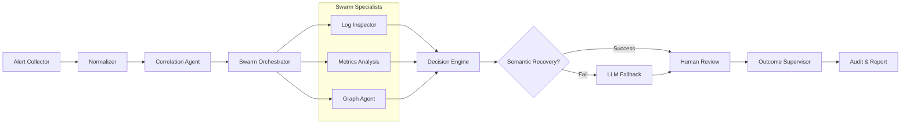

# 🤖 Strands Agents: Technical Documentation

This document provides an exhaustive technical overview of the agents within the Strands framework. Strands follows a **Multi-Agent Orchestration** pattern where specialized agents collaborate to resolve infrastructure incidents.

---

## 🏗️ Agent Architecture Overview

Every agent in Strands adheres to a strict contract:
- **Typed Input/Output**: Uses Pydantic models for data exchange.
- **Error Boundaries**: Implements internal retry logic and graceful failure modes.
- **Observability**: Structured logging with unique trace IDs.

---

## 1. Core Pipeline Agents

These agents form the primary sequential pipeline for incident processing.

### 🧩 AlertCorrelationAgent
- **Role**: Groups individual alerts into logical clusters based on time, service, and metadata.
- **Input**: `List[Alert]`
- **Output**: `List[AlertCluster]`
- **Logic**: Uses sliding window algorithms and service dependency mapping to reduce noise.

### 📊 MetricsAnalysisAgent
- **Role**: Analyzes telemetry data (CPU, Memory, Latency) to find anomalies.
- **Input**: `AlertCluster`
- **Output**: `MetricTrend`
- **Features**: Implements p95 filtering and multi-metric fusion.

### 🧠 DecisionEngine
- **Role**: The primary reasoning unit that synthesizes evidence into a resolution plan.
- **Input**: `AlertCluster`, `MetricTrend`, `SemanticEvidence`
- **Output**: `Decision`
- **Recovery Flow**: Integrates `SemanticRecoveryService` (GraphRAG) as a high-confidence fallback before raw LLM invocation.

### 📝 ReportAgent
- **Role**: Generates human-readable post-mortems and audit logs.
- **Input**: `Decision`, `AlertCluster`
- **Output**: `AuditLog`
- **Principle**: Ensures full traceability of the autonomous decision process.

---

## 2. Swarm & Analysis Agents

Specialized agents that run in parallel during the investigation phase.

### 🐝 SwarmOrchestrator
- **Role**: Manages the lifecycle of parallel investigation agents.
- **Mechanism**: Uses `asyncio.gather` for concurrent execution with partial failure tolerance.

### 🔍 LogInspectorAgent
- **Role**: Interacts with Kubernetes APIs to fetch and analyze pod logs.
- **Tools**: `kubectl`, Kubernetes Python Client.
- **Logic**: Identifies stack traces, OOMKills, and application-level errors.

### 🕸️ GraphAgent
- **Role**: Navigates the Neo4j Knowledge Graph to find service dependencies and historical impact.
- **Input**: `Entity`
- **Output**: `GraphContext`

---

## 3. Governance & Human-in-the-Loop

Agents responsible for safety, validation, and learning.

### 👤 HumanReviewAgent
- **Role**: Manages the workflow for human operators to approve or reject autonomous decisions.
- **States**: `PENDING_REVIEW` → `APPROVED` | `REJECTED`.
- **Principle**: Constitution Principle I (HITL).

### 🛡️ OutcomeSupervisor
- **Role**: Monitors the execution of a decision and validates if the incident was actually resolved.
- **Feedback Loop**: Feeds successful outcomes back into the Knowledge Graph for future learning.

---

## 🔄 Pipeline Flow Diagram

---

## 🛠️ Developer Guide: Creating a New Agent

To implement a new agent, follow the `BaseAgent` pattern:

1.  **Define the Contract**: Create Pydantic models for input and output.
2.  **Implement Logic**: Extend the `BaseAgent` class.
3.  **Register Tools**: If the agent uses external tools, register them in the `ProviderFactory`.
4.  **Add Tests**: Every agent must have a corresponding unit test in `tests/unit/`.
